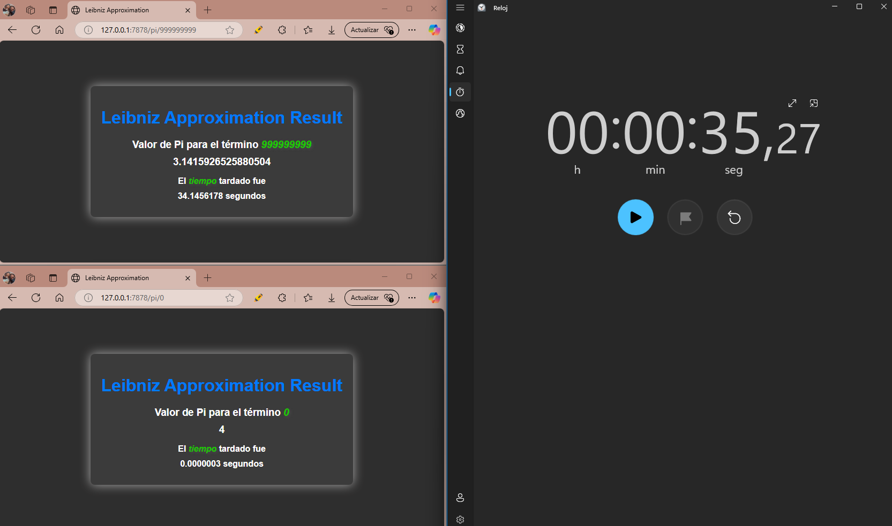

# Concurrency Programming

Students:
- Correa Ignacio
- Iglesias Julieta

## TP1 ~ HTTP Server

1. ¿Qué sucede con dos requests simultáneas que tardan en procesarse?

Al mandar dos requests simultáneamente (la primera con un n muy grande y la segunda con uno muy chico),
observamos que la segunda, a pesar de ser mucho más pequeña, tuvo que esperar a que se finalice el
cálculo de la primera para devolver su respuesta.

2. ¿Por qué se observa este comportamiento?

Esto se debe a que el servidor no está hecho para manejar correctamente la llegada de varias solicitudes
simultáneas. A primera vista, la causa principal es que es single-threaded.

3. ¿Cómo solucionar usando solo librerías estándar de Rust?

Para hacer que el servidor sea multithreaded usando solo las librerías estándar de Rust, se podría usar
el módulo 'std::thread' para crear un nuevo hilo para cada conexión entrante.

## TP2 ~ Concurrent HTTP Server

Para probar el servidor multi-threaded, decidimos aplicar el comando de Apache Benchmark con distintos
conjuntos de argumentos, variando la cantidad total de requests (n), la concurrencia total (c) y la
cantidad de términos para pi.

A partir de las pruebas, notamos que, mientras más exacto es el pi, menos requests por segundo son
completadas por el servidor, manteniéndose casi constante aún con el aumento de c. Esto quiere decir que
haciendo que las requests tengan su propio thread, no significa que el tiempo de procesamiento de estas
sea menor (se requiere paralelización en el cálculo de los términos para eso).

En cuanto al tiempo de conexión, el tiempo se ha mantenido mínimo casi en cada test (1 milisegundo,
desestimando outliers). Solo parece aumentar cuando n y c aumentan (y aun así, son milisegundos).

En lo que refiere a procesamiento, aun cuando notamos que las requests por segundo se mantuvieron
constantes, el tiempo de procesamiento ha incrementado, a veces incluso drásticamente. Aunque pareciera
no tener sentido a primera vista (¿Cómo es posible que, aunque las requests tarden más en ser procesadas,
la cantidad de ellas procesadas por segundo se mantenga constante?), este incremento es razonable cuando
tomamos en cuenta que la cantidad de requests concurrentes ha aumentado en cada caso, haciendo que haya
cada vez más requests esperando su turno para ser procesadas.

Para entender la información que nos brinda las dos secciones de tiempo por request, primero entendamos
qué significan cada una: La primera (de mayor valor) indica el tiempo total que una request tarda en ser
procesada, sin tomar en cuenta que, al mismo tiempo que una se procesa, hay otras c - 1 requests también
siendo procesadas. La segunda demuestra el tiempo que hubiese tomado "realmente" ejecutar las requests
una por una (secuencialmente).

Se concluye que la concurrencia logra, exitosamente, aumentar la cantidad de requests atendidas en un
cierto periodo de tiempo, así como bajar (en promedio) el tiempo de procesamiento de cada una. Algo a
destacar de esto es que, en cierto momento, se encuentra un techo a la optimización que puede aportar
el multi-threading, por lo que, para poder aprovechar correctamente esta técnica, es necesario encontrar
la concurrencia pertinente para el total de requests esperados.

