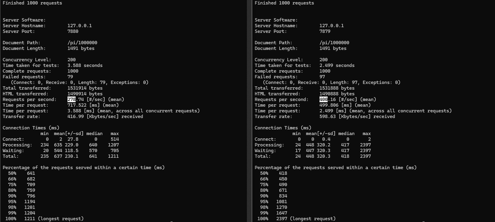
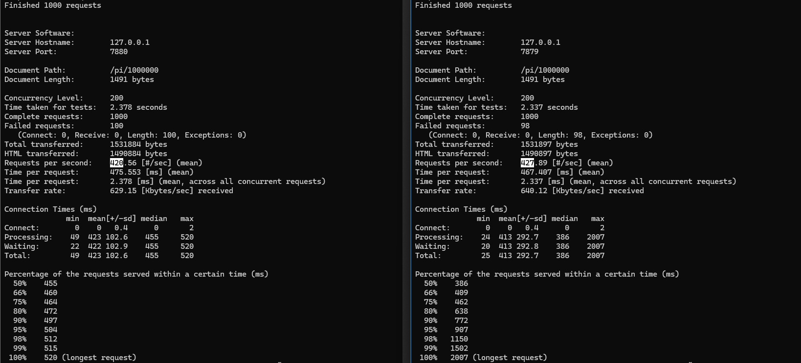
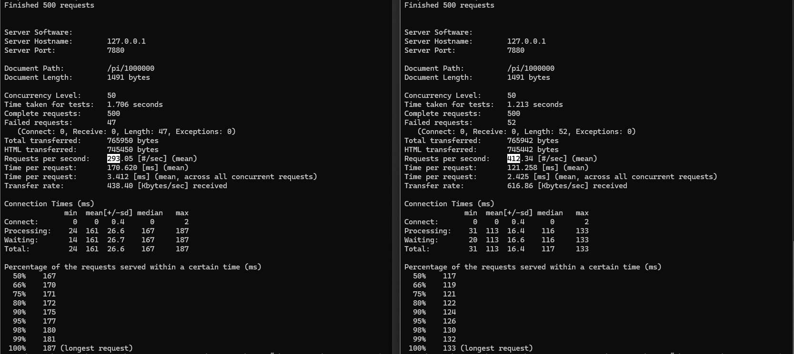
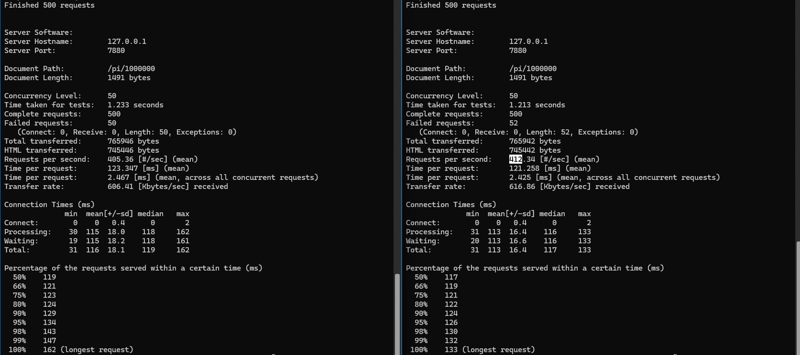

## TP3 ~ Thread Pool HTTP Server

1. Bajo carga concurrente intensa (aumentando-n y-c en ab), ¿qué efectos se observan
en el comportamiento del servidor? ¿Cómo se comparan con los resultados obtenidos en el TP2?

Lo primero que notamos es que, en ambos tipos de servidores (ThreadPool y Concurrent), el tiempo de procesamiento
total de las requests es muy parecido, con algunos outliers siendo el segundo un poco más rápido con menor cantidad
total.

Pero, encontramos una diferencia sustancial en el porcentaje de requests procesadas en cierto tiempo: mientras que
en el Concurrent la diferencia se amplía hasta aproximadamente el doble, en el ThreadPool la diferencia es mínima.
Esto se lo atribuímos a los context switches que ocurren en el Concurrent, ya que cada request está asociado a su
propio thread, haciendo que cuando termine de procesarse, el programa tenga que desasociar los recursos que este
usaba. Mientras que en el ThreadPool, como los threads que se usan son siempre los mismos, no ocurre este overhead.

2. ¿Cómo se ve afectado el comportamiento ante carga concurrente intensa
   para diferentes tamaños de thread pool?

Con pool size menor a la cantidad de procesadores lógicos, se tarda más, atiende menos requests y tarda más en
cuanto a porcentajes.
Con pool size de igual cantidad, se es más rápido, con más requests y con menos tiempo entre porcentajes.

Con pool size de mayor cantidad, el programa tiene un desempeño muy parecido al de igual cantidad (con una
diferencia mínima en el tiempo y la cantidad de requests), pero tarda más en aumentar el porcentaje de
requests atendidas.

